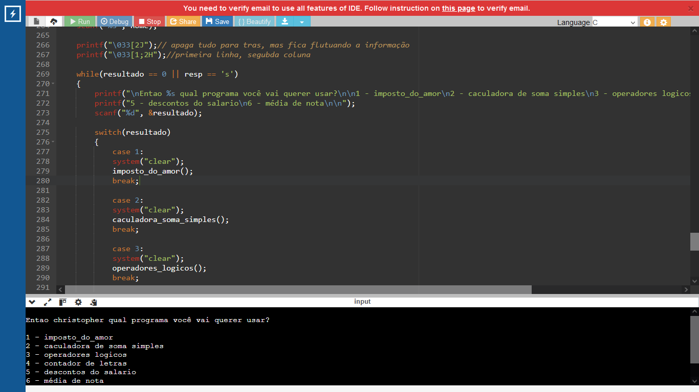
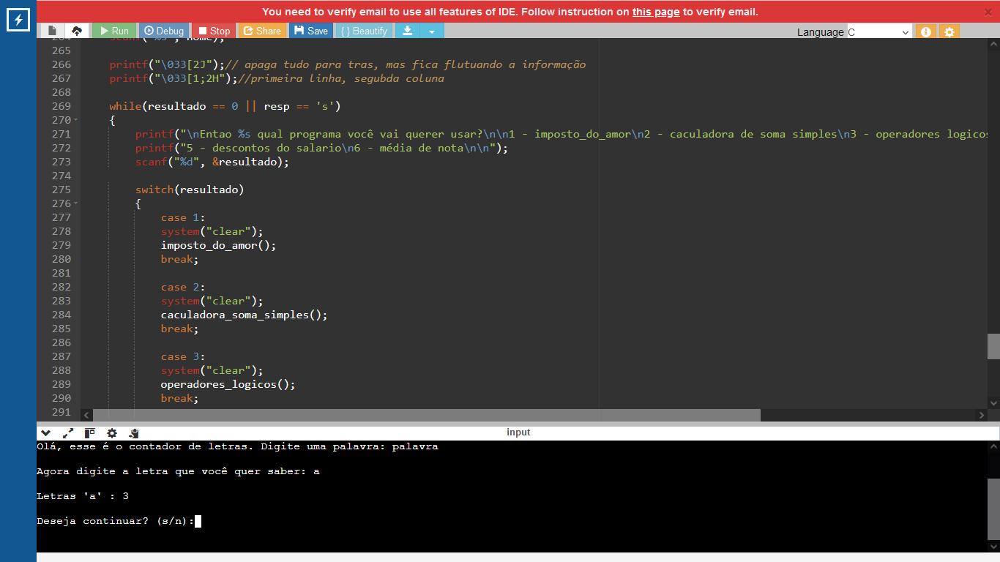

# Projeto: Múltiplas Funções

## Descrição

O projeto **Múltiplas Funções** é uma aplicação desenvolvida em C que fornece uma série de fórmulas e cálculos matemáticos variados. O objetivo é oferecer uma ferramenta prática para realizar cálculos comuns e úteis em diversas situações.

## Funcionalidades

O projeto inclui as seguintes funcionalidades:

- **Cálculo de Média:**
  - Calcula a média aritmética de um conjunto de números fornecidos pelo usuário.

- **Desconto de INSS:**
  - Calcula o desconto do INSS (Instituto Nacional do Seguro Social) com base no salário fornecido.

- **Cálculo de Imposto:**
  - Calcula o valor do imposto a ser pago com base em uma porcentagem fornecida e no valor da base de cálculo.

- **Contador de Letras:**
  - Conta o número de letras em uma palavra fornecida pelo usuário, ignorando espaços e caracteres especiais.

- **Calculadora:**
  - Realiza operações matemáticas básicas, como adição, subtração, multiplicação e divisão.

## Estrutura do Projeto

O código-fonte do projeto está organizado da seguinte forma:

- `main.c`: Arquivo principal onde são feitas as chamadas das funções e a interação com o usuário.
- `funcoes.c`: Contém a implementação das funções para cálculos e utilitários.
- `funcoes.h`: Arquivo de cabeçalho que declara as funções disponíveis em `funcoes.c`.
- `Makefile`: Arquivo para automação da compilação do projeto.

## Fotos



## Compilação e Execução

Para compilar o projeto, utilize o `Makefile` incluído. Navegue até o diretório do projeto e execute o comando:

```bash
make
./multiplicafuncoes
